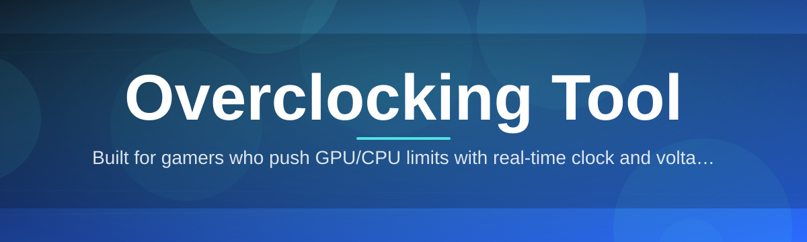
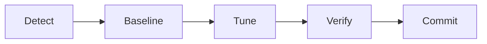

# overclocking-booster ⚡🔥

  

*Tune your silicon like an instrument, not a gamble.*

  

> [!NOTE]
> **TL;DR**
> - **overclocking-booster** is a standalone Windows utility for tuning CPU, GPU, and memory clocks with real-time telemetry.
> - No dependencies, no background services — download, run, tune, done.
> - Built for enthusiasts, benchmarkers, and system builders who want predictable headroom, not guesswork.

---

## 🧠 Overview

Overclocking has always lived in a weird spot between engineering and folklore — forum threads full of "magic voltages," spreadsheets nobody trusts, and stability tests that lie. **overclocking-booster** exists to replace that folklore with a clean, data-driven workflow. It reads your hardware's real operating envelope, exposes the levers that actually matter (core ratios, voltage offsets, memory timings, power limits), and gives you live feedback so every adjustment is measured, not guessed.

This tool is built for people who treat their rig as a system, not a slot machine: benchmarkers chasing leaderboard stability, gamers squeezing extra frames out of aging silicon, and system builders validating headroom before a build ships. It doesn't try to be a chatty assistant or an all-in-one PC "suite" — it's a focused overclocking tool that does clock, voltage, and thermal tuning extremely well, and gets out of your way otherwise.

Under the hood, **overclocking-booster** talks directly to your platform's sensor and clocking interfaces, aggregates the noise into stable readings, and renders it all in a dashboard that updates fast enough to actually catch instability before it becomes a crash. Think of it as the missing telemetry layer between your BIOS and your ambition.

## 📥 Get the Tool

---

## 🛠️ What It Actually Does

**Live Clock Ramp Visualizer** — watch core and boost clocks shift in real time on a scrolling graph, so throttling and instability show up visually instead of hiding in a log file.

**Voltage Curve Editor** — draw your own frequency-to-voltage curve point by point instead of accepting a flat offset across the whole range.

**Silent Stability Sweep** — an automated background sweep nudges clocks upward in small steps and flags the exact point where errors start, without needing a separate stress-test app.

**Thermal Headroom Meter** — a single gauge that translates raw temperature and power draw into "how much room do you actually have left," rather than making you do the math.

**Memory Timing Playground** — adjust primary, secondary, and tertiary memory timings with guardrails that stop you from setting combinations known to hang on POST.

**One-Click Profile Snapshots** — save any tuned state as a named profile and switch between "quiet," "balanced," and "unleashed" in seconds.

**Sensor Fusion Dashboard** — merges readings from multiple sensor sources into one trustworthy number instead of showing five conflicting temperatures.

**Undo-Safe Apply Engine** — every change is staged before it's committed, with a rollback window in case the new clock doesn't boot cleanly.

**Silent Startup Mode** — launch minimized to the tray with your last profile auto-applied, so tuning happens once and just persists.

> [!TIP]
> Start every session with the **Silent Stability Sweep** before manually pushing anything — it gives you a baseline ceiling in minutes, saving hours of manual trial and error.

---

## 🚀 How to Get Started

1. **Visit the landing page** using the download button above.

2. **Download the latest build** — it ships as a single standalone executable, no installer wizard required.

3. **Run it** — Windows may show a SmartScreen prompt on first launch since the binary is freshly signed each release; click "More info → Run anyway."

4. **Pick a profile** (Quiet, Balanced, or Unleashed) or start from a blank slate and let the Silent Stability Sweep suggest a ceiling.

> [!IMPORTANT]
> Always close other GPU- or CPU-intensive monitoring tools before running the stability sweep — overlapping sensor polling from multiple apps is the #1 cause of false instability readings.

---

## 💻 System Requirements

| Component | Minimum | Notes |
|---|---|---|
| **OS** | Windows 10 (64-bit) | Windows 11 fully supported |
| **CPU** | Any modern x86-64 | Unlocked multiplier recommended for full range |
| **GPU** | DirectX 12 capable | Vendor overclocking interface required |
| **RAM** | 4 GB free | Tool itself is lightweight |
| **Disk** | 150 MB | No install, portable executable |
| **Dependencies** | None | Fully standalone, no runtime installs needed |
| **Permissions** | Administrator | Required to write clock/voltage tables |

  

---

## ⚙️ How It Works

The internal flow is intentionally simple — read, propose, verify, commit:

1. **Detection** — the tool enumerates CPU, GPU, and memory controllers and pulls their current clock/voltage tables.
2. **Baseline capture** — a short idle-and-load pass establishes your "stock" reference point.
3. **Tuning pass** — your manual edits or the automated sweep generate a candidate profile.
4. **Verification** — the candidate is stress-checked against thermal and error thresholds.
5. **Commit or rollback** — stable results are saved as a profile; unstable ones are reverted automatically.

> [!WARNING]
> Skipping the verification step by manually forcing a commit can leave your system in a state that fails to POST. Always let the verify stage complete, especially after aggressive memory timing changes.

---

## 🧩 Troubleshooting

<strong>My clocks revert to stock after a reboot — why?</strong>

By design, profiles aren't auto-applied at boot unless you enable **Silent Startup Mode** in Settings. This prevents an unstable overclock from silently surviving a crash loop.

<strong>The Stability Sweep flagged errors almost immediately.</strong>

This usually means your baseline voltage curve is already too aggressive for the current ambient temperature. Try running the sweep again after your system has been idle for a few minutes.

<strong>Sensor readings look frozen or delayed.</strong>

Close any other hardware monitoring software. Simultaneous polling from multiple tools can lock the sensor bus and cause stale readings in the dashboard.

<strong>Windows SmartScreen blocked the executable.</strong>

This is expected for a fresh build without a long-established signing reputation. Click "More info → Run anyway" to proceed — the binary hash is listed on the landing page for verification.

<strong>Can I use this alongside my motherboard vendor's own tuning software?</strong>

Not recommended simultaneously — both tools writing to the same voltage tables can conflict. Pick one as your source of truth per session.

<strong>My memory timings caused a black screen on boot.</strong>

Clear CMOS or use your motherboard's safe-boot button, then relaunch the tool and use the Memory Timing Playground's guardrail mode, which blocks known-bad combinations.

---

## 🎨 UI / UX Details

| Shortcut | Action |
|---|---|
| `Ctrl + S` | Save current profile |
| `Ctrl + R` | Revert to last stable snapshot |
| `Ctrl + Space` | Trigger Silent Stability Sweep |
| `F5` | Refresh sensor fusion dashboard |
| `Ctrl + ,` | Open Settings |
| `Esc` | Cancel a pending (uncommitted) change |

- **Themes**: Light, Dark, and an OLED-friendly true-black mode.

- **Layout**: Dockable panels — rearrange the clock graph, voltage curve, and sensor readouts to match your monitor setup.

- **Settings persistence**: All preferences and profiles are stored locally in a portable config file next to the executable.

> [!TIP]
> Dark mode plus the true-black variant is easiest on the eyes during long overnight stability runs.

---

## 🤝 Contributing & Community

Contributions, bug reports, and profile-sharing discussions are welcome. A few ground rules:

- Open an issue before a large pull request so the direction can be discussed first.
- Keep platform-specific code isolated and well-commented — clocking interfaces vary wildly across vendors.
- Include your hardware configuration when reporting stability or sensor bugs; "it didn't work" without context is hard to act on.

 

> [!NOTE]
> Community-shared profiles are just suggestions, not guarantees — silicon quality varies chip to chip, so always re-run the Stability Sweep before trusting someone else's numbers.

---

## 📜 License

Released under the [MIT License](LICENSE), 2026.

## ⚠️ Disclaimer

Overclocking modifies your hardware's operating parameters beyond factory-set defaults and inherently carries risk, including instability, data loss, or hardware degradation. **overclocking-booster** provides tools and telemetry to make this process safer and more measurable, but it cannot guarantee outcomes for every combination of hardware, cooling, and silicon quality. Use responsibly, monitor temperatures closely, and always know how to reset to stock settings on your specific platform.

---

